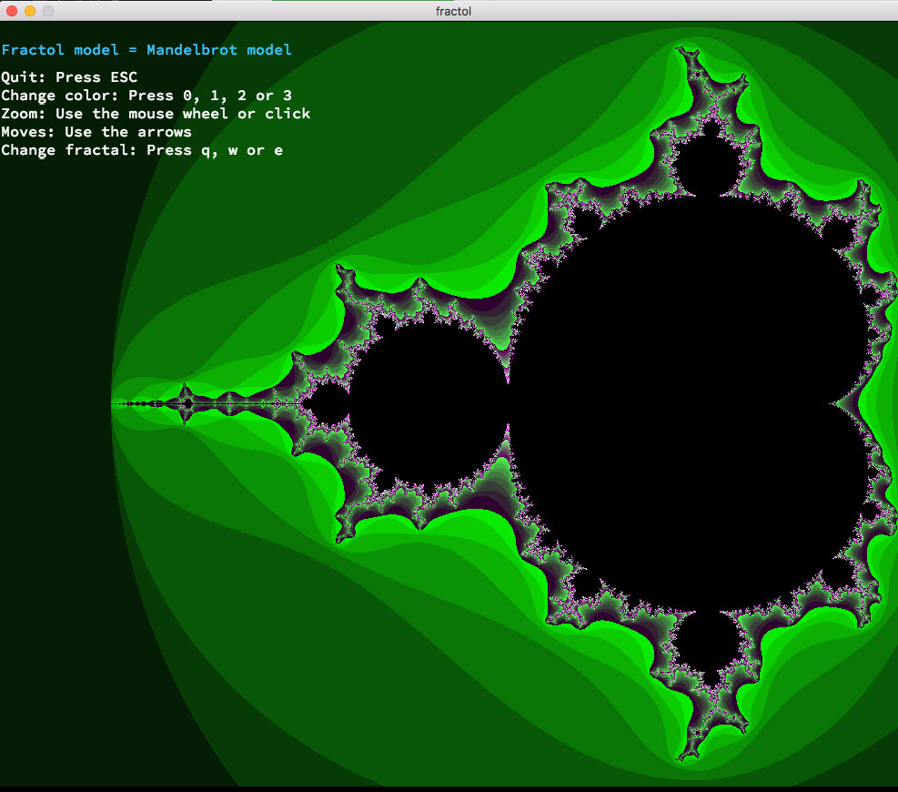
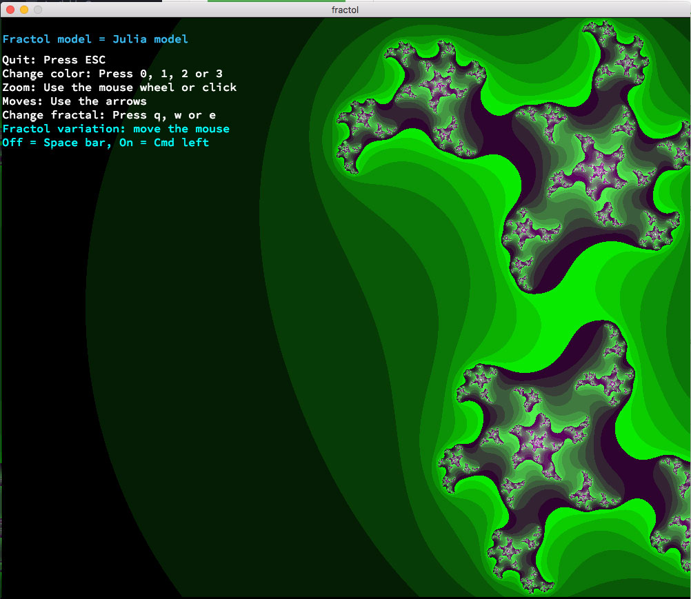
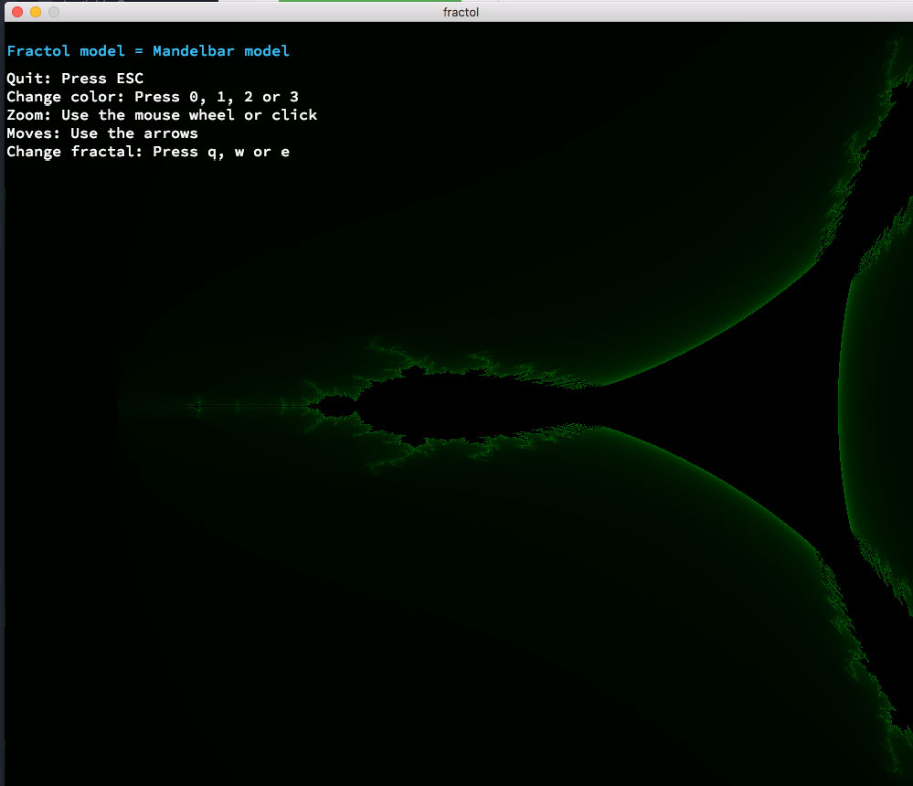

# Fractol

<i>Graphic programming project</i> 
A program which is displaying small fractals (Mandelbrot, Julia, Mandelbar...).
 
 
<b>USAGE:</b> <i>./fractol [1, 2 or 3]</i>
 
 
<b>HOW TO:</b>
 
- Fractol variation: move the mouse 
- Off = Space bar 
- On = Cmd left 
- Quit: Press ESC 
- Change color: Press 0, 1, 2 or 3 
- Zoom: Use the mouse wheel or click 
- Moves: Use the arrows 
- Change fractal: Press q, w or e 
 
 
<b>1-Mandelbrot model:</b>
 

 
 
<b>2-Julia model:</b>
 

 
 
<b>3-Mandelbar model:</b>
 

